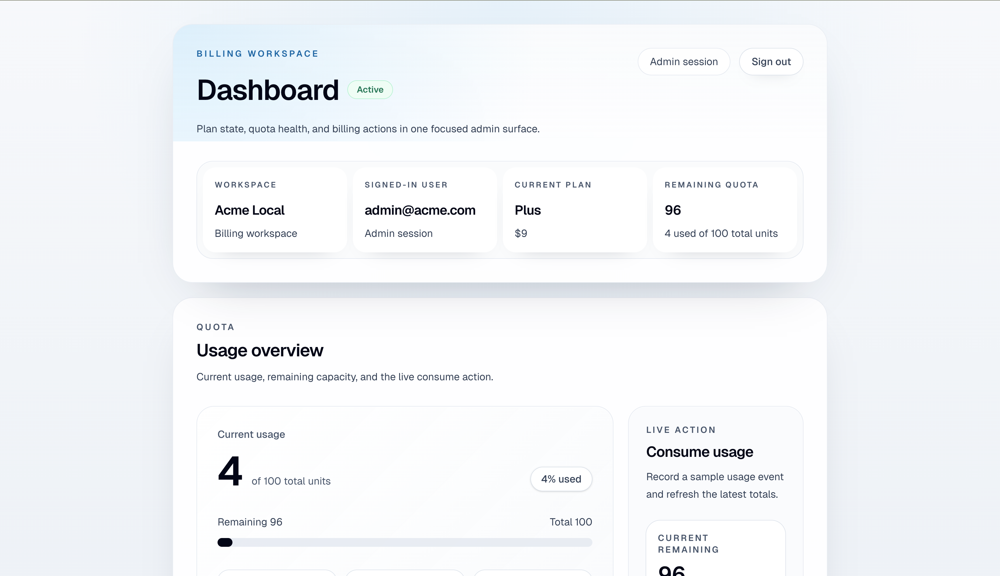
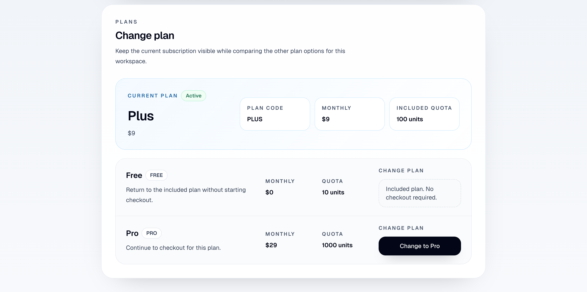

# Multi-Tenant SaaS Billing Orchestrator

**Production-minded Spring Boot backend for multi-tenant SaaS billing, canonical subscription fulfillment, Redis-backed quota enforcement, and a thin Next.js frontend MVP.**

It demonstrates browser-safe product flows on top of a backend that owns billing rules, tenant-safe product contracts, and quota behavior.
## Demo preview

**Live demo:** not currently deployed. See the demo preview below.

**Demo flow**


**Dashboard main**


**Change plan**


---

## Project summary

**Multi-Tenant SaaS Billing Orchestrator** is a backend-centered billing system for subscription-backed SaaS products. The core of the project is not the UI layer; it is the backend logic that keeps tenant-scoped subscription identity, paid-plan fulfillment, and quota state consistent.

A key hardening step was introducing **canonical `PlanCode`-based billing fulfillment**. The browser sends `planCode`, not Stripe `priceId`. The backend resolves Stripe commercial identifiers privately, writes the purchased `planCode` into Stripe subscription metadata at checkout time, and uses `invoice.paid` to canonicalize persisted subscription state and quota totals from backend-owned plan definitions. This fixed a real drift bug where persisted plan identity and quota totals could diverge.

The project also draws a clear **browser-safe product boundary**. Browser flows use dedicated JWT-protected endpoints and do not consume machine-facing `/api/v1/**` APIs. Browser-safe responses do not expose tenant API keys, Stripe customer IDs, Stripe price IDs, or other machine-facing identifiers.

Beyond billing correctness, the backend includes **idempotent Stripe webhook processing** and **Redis-backed quota enforcement** with atomic decrement and anti-stampede protection when quota state is cold in cache. The frontend under `/frontend` is intentionally thin and exists to demonstrate these backend-owned product flows.

---

## Key engineering decisions

### 1. Canonical billing fulfillment with backend-owned commercial truth

The application uses `PlanCode` as the canonical plan identity:

- `FREE`
- `PLUS`
- `PRO`

The browser sends `planCode`, not Stripe `priceId`. The backend validates the requested plan, rejects `FREE` for paid Stripe checkout, and resolves Stripe price IDs privately from backend configuration.

Checkout writes the purchased `planCode` into Stripe subscription metadata. On `invoice.paid`, the backend reads that metadata back and canonicalizes persisted subscription state from backend-owned plan definitions. Persisted `subscription.plan_code`, `subscription.quota_total`, `subscription.quota_used`, `subscription.status`, and `tenant.quota_balance` are updated from the canonical plan model rather than inferred indirectly from Stripe pricing data.

This matters because it fixes a real billing drift bug: persisted plan identity and quota totals can no longer silently diverge.

### 2. Browser-safe product boundary, separate from machine-facing APIs

The browser uses dedicated product endpoints such as:

- `POST /api/auth/login`
- `GET /api/me`
- `GET /api/dashboard/summary`
- `POST /api/demo/usage/consume`
- `POST /api/checkout/create-session`

These flows are JWT-protected and intentionally separate from `/api/v1/**`, which remains machine-facing. Browser-safe responses do not expose machine-facing identifiers or Stripe commercial IDs.

### 3. Idempotent Stripe webhook processing

Duplicate `invoice.paid` deliveries are blocked by a database-backed idempotency barrier. Canonical fulfillment logic runs only after the event lock is acquired, so duplicate webhook delivery does not double-apply subscription resets or quota updates.

### 4. Redis-backed quota correctness under concurrent access

Quota consumption uses an atomic Redis decrement script on the hot path. When quota state is missing from Redis, `M2MGatewayService` uses a per-tenant local JVM lock to prevent cold-cache stampede against PostgreSQL before reinitializing quota state and retrying consumption.

This is worth highlighting as a correctness and control-path decision, not as a vague “high concurrency” claim.

### 5. Thin frontend, backend-owned contracts

The frontend is intentionally thin: Next.js, TypeScript, App Router, and plain `fetch`. It demonstrates real product flows, but the backend remains the source of truth for contracts, billing behavior, and fulfillment logic.

---

## Architecture at a glance

The project is intentionally backend-centered. The frontend stays thin, while the backend owns tenant-aware plan identity, checkout behavior, webhook fulfillment, quota state, and browser-safe product contracts.

### Backend

- Spring Boot backend for product contracts and billing behavior
- PostgreSQL for persisted tenant, subscription, and payment-event state
- Stripe for paid checkout and subscription webhook fulfillment
- JWT for browser-safe authenticated flows
- Redis for quota enforcement and fast quota state access

### Browser-safe boundary

The browser talks only to browser-safe endpoints. It does not use `/api/v1/**`, and it does not receive:

- `tenantApiKey`
- `stripeCustomerId`
- Stripe `priceId`
- other machine-facing secrets or identifiers

### Machine-facing quota path

`/api/v1/**` remains machine-facing. That path uses API-key interception plus Redis-backed quota consumption. Redis quota decrement is atomic, and cold-cache recovery is guarded by anti-stampede protection in `M2MGatewayService`.

### Frontend (`/frontend`)

The frontend exists to exercise the implemented backend flows:

- login
- dashboard summary
- demo usage consumption
- plan change / checkout redirect
- success / cancel return

It is intentionally thin and backend-driven rather than a frontend-heavy architecture exercise.

---

## What is implemented

The current implemented product flow is:

1. login
2. dashboard loads backend-driven data
3. usage consumption works from the UI
4. quota refresh works
5. plan-change / checkout redirect works
6. Stripe success/cancel return works
7. dashboard reflects refreshed backend state after return

Implemented browser-safe backend surface for the frontend MVP:

- `POST /api/auth/login`
- `GET /api/me`
- `GET /api/dashboard/summary`
- `POST /api/demo/usage/consume`
- `POST /api/checkout/create-session`

Implemented backend integrity work worth highlighting:

- canonical `PlanCode`-based billing fulfillment
- backend-owned Stripe price resolution
- webhook idempotency barrier for duplicate `invoice.paid`
- Redis atomic quota decrement
- anti-stampede quota initialization in `M2MGatewayService`
- persistence cleanup from `subscriptions.plan_tier` to `subscriptions.plan_code`

Frontend MVP status:

- implemented under `/frontend`
- thin and backend-driven
- Next.js + TypeScript + App Router + plain `fetch`
- no Redux / React Query / Axios
- final QA passed for login, protected dashboard access, dashboard load, usage consume flow, quota refresh, checkout redirect, success/cancel return, and logout behavior.

---

## Demo flow

Recommended reviewer / interviewer flow:

1. **Log in** through the browser-safe authentication flow.
2. **Load the dashboard** and confirm subscription and quota data come from the backend.
3. **Consume usage** from the UI to exercise the browser-safe usage path.
4. **Refresh quota** and verify updated backend state is reflected in the dashboard.
5. **Start a paid plan change** from the dashboard. The browser sends `planCode`; the backend resolves Stripe pricing privately.
6. **Return from Stripe** through either the success or cancel path.
7. **Verify refreshed backend state** after return.

The point of the demo is not frontend complexity. It is to show a thin frontend exercising backend-owned billing and quota flows.

---

## Repository structure

```text
.
├── frontend/                   # Next.js frontend MVP
├── resources/demo/             # demo GIF
├── resources/screenshots/      # README screenshots
├── src/main/java/...           # Spring Boot backend source
├── src/main/resources/         # app config + Flyway migrations
├── docker-compose.yml
└── pom.xml
```

The frontend and backend live in the same repository, but the backend remains the source of truth for contracts and business behavior.

## Local run instructions

### Prerequisites

- Java 17+
- Maven 3.9+
- Node.js 18+
- Docker Desktop
- Stripe test keys for checkout testing

### 1. Start local infrastructure

From the repository root:

```bash
docker-compose up -d
```

This starts local PostgreSQL and Redis.

### 2. Configure backend environment

#### Environment variables

```bash
# --- Spring Boot Profile ---
SPRING_PROFILES_ACTIVE=dev
# --- JWT ---
APP_JWT_SECRET=replace-with-at-least-32-characters
APP_JWT_EXPIRATION_SECONDS=3600
# --- PostgreSQL ---
BILLING_DB_URL=jdbc:postgresql://localhost:5432/sbo_dev
BILLING_DB_USERNAME=sbo_admin
BILLING_DB_PASS=password
# --- Redis ---
REDIS_HOST=localhost
REDIS_PORT=6379
QUOTA_RECONCILIATION_DELAY_MS=300000
# --- Stripe ---
STRIPE_PUBLISHABLE_KEY=pk_test_xxx
STRIPE_SECRET_KEY=sk_test_xxx
STRIPE_WEBHOOK_SECRET=whsec_xxx
STRIPE_PRICE_ID_PLUS=price_xxx
STRIPE_PRICE_ID_PRO=price_xxx
```

#### Stripe configuration (Sandbox)

1. Create a test customer in Stripe.
2. Create two products/prices in Stripe for:
  - Plus
  - Pro
3. Copy the resulting Stripe price IDs into:
  - `STRIPE_PRICE_ID_PLUS`
  - `STRIPE_PRICE_ID_PRO`

### 3. Run the backend

From the repository root:

```bash
./mvnw spring-boot:run
```

Flyway auto-runs migrations from `src/main/resources/db/migration/` on startup.

### 4. Seed local dev data

Use SQL to create a tenant, user, and subscription for local testing:

```sql
INSERT INTO tenants(company_name, tenant_api_key, quota_balance, create_time, update_time)
VALUES ('Acme Inc', 'acme_prod_demo_key', 1000, now(), now());

INSERT INTO subscriptions(tenant_id, stripe_customer_id, plan_code, quota_total, quota_used, status, create_time, update_time)
VALUES (
  (SELECT id FROM tenants WHERE tenant_api_key = 'acme_prod_demo_key'),
  'cus_test_acme_001',
  'PRO',
  1000,
  0,
  'ACTIVE',
  now(),
  now()
);

-- Generate a BCrypt hash locally and replace the placeholder before inserting the user row.
INSERT INTO users(tenant_id, email, password_hash, create_time, update_time)
VALUES (
  (SELECT id FROM tenants WHERE tenant_api_key = 'acme_prod_demo_key'),
  'admin@acme.com',
  '<BCrypt_HASH_FOR_YOUR_PASSWORD>',
  now(),
  now()
);
```

After inserting the seeded user, log in with:

- email: admin@acme.com
- password: the plain-text password you used when generating the BCrypt hash

### 5. Run the frontend

From the `/frontend` directory:

```bash
npm install
npm run dev
```

### 6. Open the app

Open the frontend URL shown by Next.js in your browser and follow the core demo flow:

1. log in
2. load the dashboard
3. consume usage
4. refresh quota
5. start checkout
6. return from Stripe success/cancel flow

### 7. Optional Stripe webhook testing

Start Stripe CLI forwarding:

```bash
stripe listen --forward-to localhost:8080/api/webhooks/stripe
```

Copy the generated webhook secret into `STRIPE_WEBHOOK_SECRET`, then trigger a test event:

```bash
stripe trigger invoice.paid
```

---

## Scope and boundaries

This project is intentionally strongest in backend billing correctness and backend-owned product contracts.

Scope:

- substantial Spring Boot backend
- browser-safe product flow for login, dashboard, usage, and checkout
- thin frontend MVP for demo and interview use
- canonical billing fulfillment from `PlanCode`
- machine-facing quota path kept separate from browser flows

Boundaries:

- the browser does not use `/api/v1/**`
- browser-safe responses do not expose machine-facing identifiers
- the frontend stays thin and backend-driven
- `subscriptions.plan_code` remains string-backed for now
- this README describes implemented behavior, not future billing redesign ideas

The current priority is packaging, demo clarity, and interview readiness rather than expanding project scope.

---

## Trade-offs and deferred work

- The frontend is intentionally thin; this project is not positioned as a frontend architecture exercise.
- Browser-safe APIs remain separate from machine-facing `/api/v1/**` rather than collapsing both flows into one surface.
- `subscriptions.plan_code` remains string-backed for now; direct JPA enum mapping is deferred.
- Success and cancel return pages remain intentionally simple.
- Broader billing policy work and frontend architecture expansion are deferred until after packaging and deployment-readiness work.

---
